# How internet works
- Our computer (unique IP address) <> ISP <> Server of some website address we want to use (unique IP address)
- Information transmitted between our PC --> ISP --> Server and back, based on (unique IP address)
- Our PC store cache copy of a local version of the website (related to prank)
- World connected via under sea cables
https://www.submarinecablemap.com/
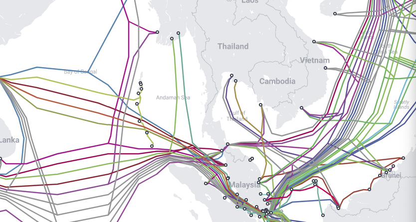

# How website works
Components
- HTML = structure
- CSS = beauty
- JS = function

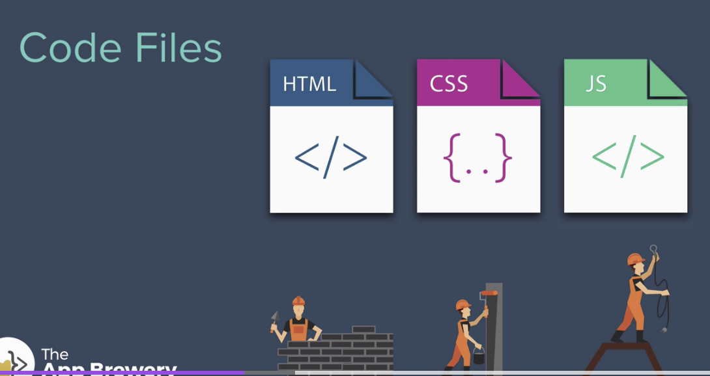

- Prank demo
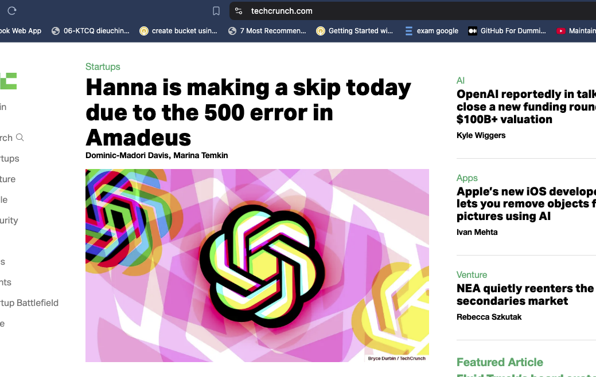
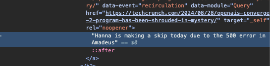

this is possile because the local cache of website on our computer, at refresh --> returns to original codings.


## HTML
HTML tags:
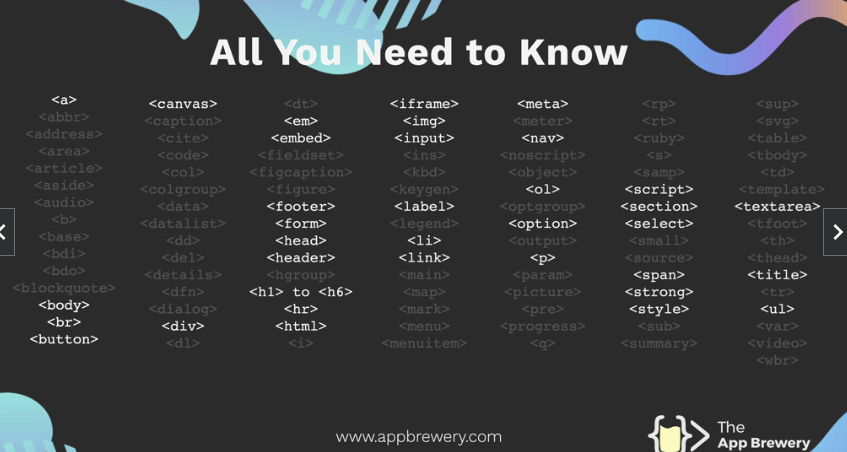

### HTML heading elements
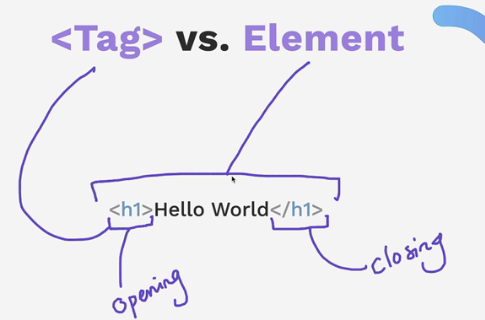

### Void elements
#### Horizontal rule element
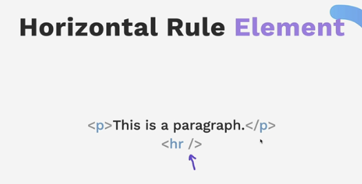
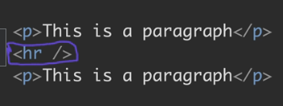

### Break element
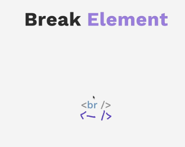
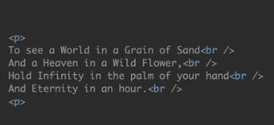


### HTML boilerplate
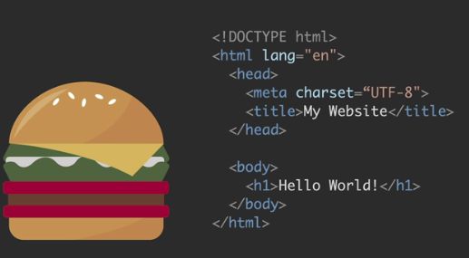

- Indenting is important for readability
- There can be more in <head></head>
- Main content of website is in the <body></body>

### List elements

#### Unordered list
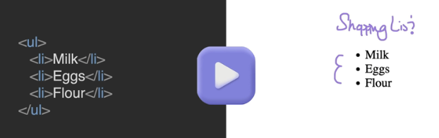

#### Ordered list
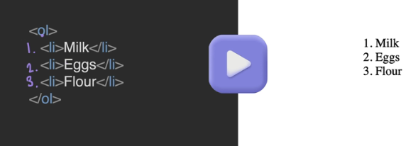

### Nesting and indentation
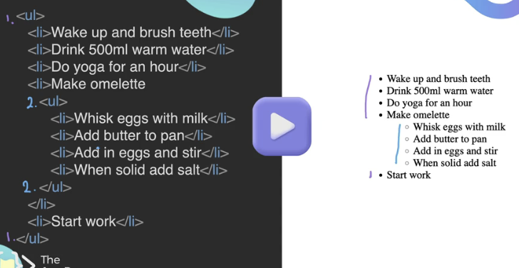

### Anchor elements
[Anchor Element](https://developer.mozilla.org/en-US/docs/Web/HTML/Element/a)


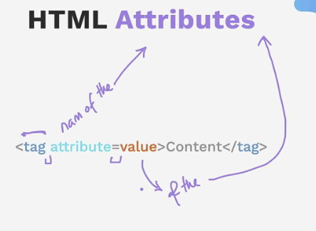
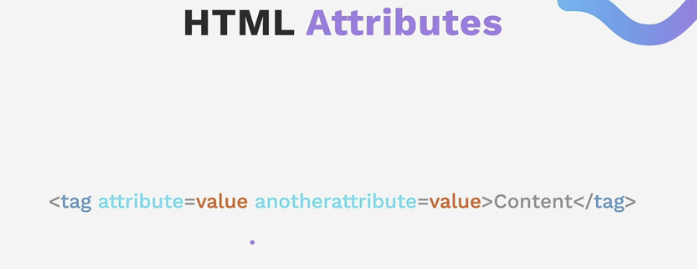

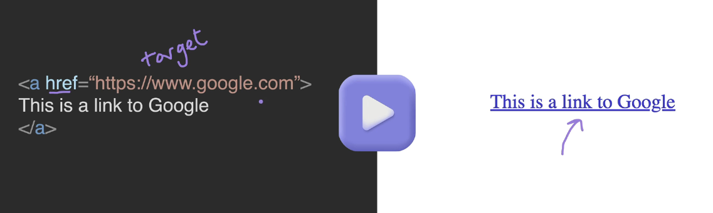

### Image elements
It is a void element, no closing tag
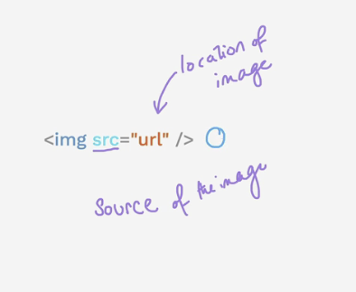
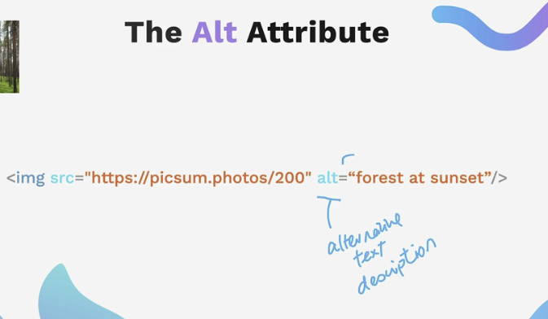 
* the 200 = size of photo
* the alt text = help read out loud for accessability for people who cannot see the website

## CSS

### How to add CSS to HTML website


- Inline
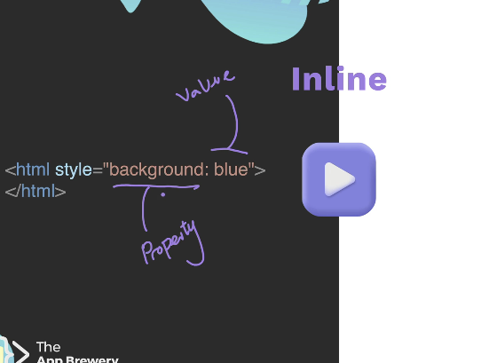

- Internal
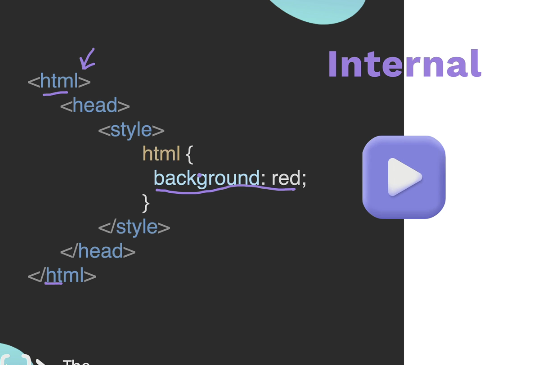

- External (mostly used)
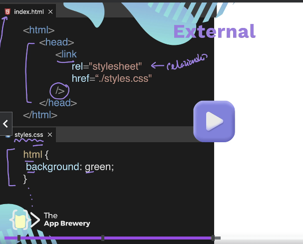

### CSS selectors

```css
h1 {
  color: "red"
}
/* In this case the h1 is CSS selector, it will make all Header1 to have this format */
```

### Class selectors

```css
.red-heading {
  color: "red"
}
/* After dot, name of class*/

<h2 class = "red-heading">Red</h2>
<h2>This will not be red-ed</h2>

```

### ID selectors 

```css
#id_something {
  color: "red"
}
/* After #, name of ID*/

<h2 id = "id_something">Red</h2>
<h2>This will not be red-ed</h2>

```

Difference between ID vs Class --> applied on 1 vs many elements.

### Attribute selectors

```css
html_element[attribute] {
  color: "red"
}
/* After dot, name of class*/

<h2 class = "red-heading">Red</h2>
<h2>This will not be red-ed</h2>

```

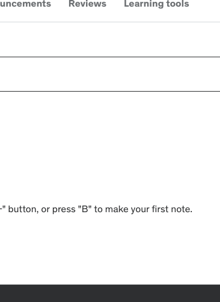
